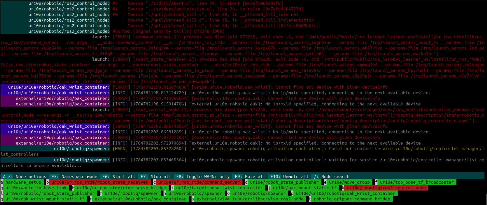

# rosmon2

`rosmon2` is a rosmon-style launcher and terminal process monitor for ROS 2.
It runs launch files through the native ROS 2 `launch` engine, so existing
Python, XML, and YAML launch files keep their normal arguments, substitutions,
and includes.

`rosmon2` is inspired by [xqms/rosmon](https://github.com/xqms/rosmon), but is
an independent ROS 2 implementation and does not require ROS 1.

## Installation and quick start

Add this repository to a ROS 2 workspace, install its dependencies, and build
it with `colcon`:

```bash
mkdir -p ~/ros2_ws/src
cd ~/ros2_ws/src
git clone https://github.com/GibsonHu/rosmon2.git

cd ~/ros2_ws
source /opt/ros/${ROS_DISTRO}/setup.bash
rosdep install --from-paths src --ignore-src -r -y
colcon build --packages-select rosmon2
source install/setup.bash
```

Then launch the included talker/listener demo:

```bash
mon2 launch rosmon2 demo.launch.py
```

Launch arguments use the standard ROS 2 `name:=value` syntax:

```bash
mon2 launch rosmon2 demo.launch.py namespace:=demo
```

You can launch a file by package and filename, as above, or by path:

```bash
mon2 launch path/to/system.launch.py use_sim_time:=true
```

The `rosmon2` executable is an alias for `mon2`, so this is equivalent:

```bash
rosmon2 launch rosmon2 demo.launch.py
```

## Screenshot



## Terminal controls

While a launch is running, the status bar shows each process and its state.
Select a process with its displayed key (`a-z`, `A-Z`, or `0-9`), then press:

| Key | Action |
| --- | --- |
| `s` | Start the selected process |
| `k` | Stop the selected process |
| `m` | Mute the selected process |
| `u` | Unmute the selected process |
| `d` | Start the selected process under `gdb` |

Global controls are available without selecting a process:

| Key | Action |
| --- | --- |
| `F5` | Toggle namespace mode |
| `F6` | Start all processes |
| `F7` | Stop all processes |
| `F8` | Toggle WARN-and-higher output |
| `F9` | Mute all process output |
| `F10` | Unmute all process output |
| `/` | Search nodes by full name |
| `Ctrl-C` | Gracefully stop the complete launch |

Node search matches substrings against full names, including namespaces. Type
`/` to start searching, use `Tab` or the arrow keys to select a match, and
press `Enter` to open its node actions. Press `Escape` to cancel the search.

Namespace mode groups processes by their top-level ROS namespace, including
nodes in child namespaces. Each namespace displays `[alive:dead]` process
counts. Its background is green when all processes are alive, yellow when only
some are alive, and red when all are dead.

Select a namespace with its displayed key, then press:

| Key | Namespace action |
| --- | --- |
| `s` | Start every process in the namespace |
| `k` | Stop every process in the namespace |
| `m` | Mute output from the namespace |
| `u` | Unmute output from the namespace |
| `i` | Inspect and control the individual processes |
| `Backspace` | Return from inspection to the namespace list |

## Command-line options

Run without the interactive terminal UI:

```bash
mon2 launch --disable-ui rosmon2 demo.launch.py
```

List the arguments declared by a launch file:

```bash
mon2 launch --list-args rosmon2 demo.launch.py
```

Load a launch description and exit, which is useful for benchmarking launch
file parsing:

```bash
mon2 launch --benchmark rosmon2 demo.launch.py
```

Discover processes without leaving them running:

```bash
mon2 launch --no-start rosmon2 demo.launch.py
```

Write combined stdout and stderr to a chosen file:

```bash
mon2 launch --log ./system.log --flush-log my_package system.launch.py
```

By default, process output is also written to a timestamped file under
`/tmp/rosmon2_*.log`. Use `mon2 launch --help` to see every option.

## Building from source

`rosmon2` is an `ament_python` package. If the repository is your workspace
root, build it from that directory. If it is inside a workspace's `src/`
directory, run `colcon build` from the workspace root:

```bash
source /opt/ros/${ROS_DISTRO}/setup.bash
colcon build --packages-select rosmon2
source install/setup.bash
```

To run the tests:

```bash
colcon test --packages-select rosmon2
colcon test-result --verbose
```

If packages installed in `~/.local` override your ROS 2 or workspace build
tools, repeat the build with `PYTHONNOUSERSITE=1` in the environment.

## License

`rosmon2` is licensed under the [BSD 3-Clause License](LICENSE).
